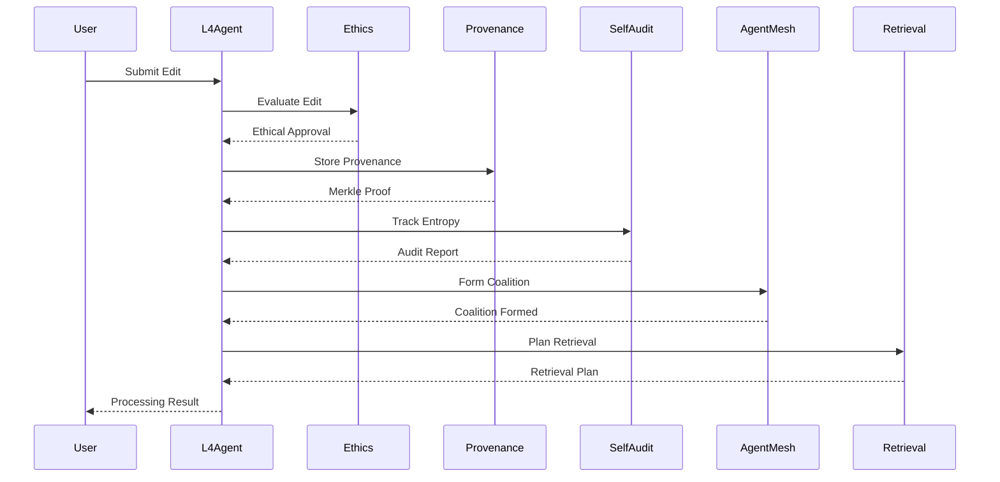
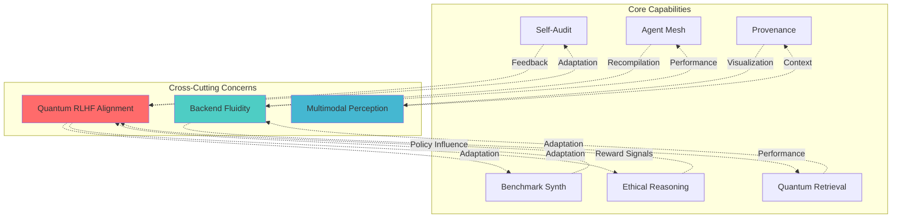
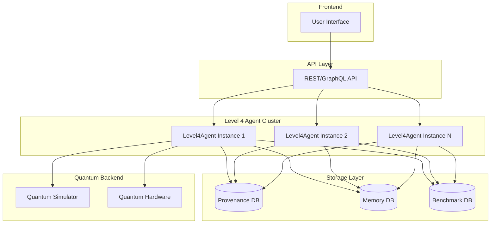

# Level 4 Architecture Diagram

## System Overview

```mermaid
graph TB
    subgraph "Level 4 Agent"
        L4[Level4Agent Orchestrator]
    end
    
    subgraph "Self-Reflection Layer"
        SA[SelfAuditModule]
        RL[ReflectionLoop]
        SA --> RL
    end
    
    subgraph "Collaboration Layer"
        AM[AgentMeshProtocol]
        TD[TaskDelegationEngine]
        AM --> TD
    end
    
    subgraph "Provenance Layer"
        PL[EditProvenanceLedger]
        LV[LineageVisualizer]
        PL --> LV
    end
    
    subgraph "Benchmarking Layer"
        BS[BenchmarkSynthesizer]
        BV[BenchmarkValidator]
        BS --> BV
    end
    
    subgraph "Retrieval Layer"
        QRP[QuantumRetrievalPlanner]
        STR[SemanticTeleportRouter]
        QRP --> STR
    end
    
    subgraph "Ethics Layer"
        ERM[EthicalReasoningModule]
        PAL[PolicyAdaptationLayer]
        ERM --> PAL
    end
    
    L4 --> SA
    L4 --> AM
    L4 --> PL
    L4 --> BS
    L4 --> QRP
    L4 --> ERM
    
    SA -.RLHF Feedback.-> RLHF[Quantum RLHF]
    AM -.Backend Recompilation.-> BF[Backend Fluidity]
    PL -.Visual Integration.-> MP[Multimodal Perception]
    BS -.Reward Divergence.-> RLHF
    QRP -.Real-time Adaptation.-> BF
    ERM -.Reward Shaping.-> RLHF
    
    style L4 fill:#ff6b6b
    style SA fill:#4ecdc4
    style AM fill:#45b7d1
    style PL fill:#96ceb4
    style BS fill:#ffeaa7
    style QRP fill:#dfe6e9
    style ERM fill:#a29bfe
```



## Data Flow



## Module Interactions

```mermaid
graph LR
    subgraph "Input Processing"
        I[Edit Input]
    end
    
    subgraph "Stage 1: Ethics"
        E1[Constraint Check]
        E2[Value Alignment]
        E3[Policy Adaptation]
    end
    
    subgraph "Stage 2: Provenance"
        P1[Fingerprint Generation]
        P2[Merkle Tree Update]
        P3[Lineage Tracking]
    end
    
    subgraph "Stage 3: Self-Audit"
        S1[Entropy Calculation]
        S2[Coherence Scoring]
        S3[Drift Detection]
    end
    
    subgraph "Stage 4: Collaboration"
        C1[Agent Selection]
        C2[Coalition Formation]
        C3[Task Delegation]
    end
    
    subgraph "Stage 5: Retrieval"
        R1[Query Embedding]
        R2[Path Planning]
        R3[Teleport Routing]
    end
    
    subgraph "Stage 6: Benchmarking"
        B1[Failure Analysis]
        B2[Benchmark Synthesis]
        B3[Validation]
    end
    
    I --> E1 --> E2 --> E3
    E3 --> P1 --> P2 --> P3
    P3 --> S1 --> S2 --> S3
    S3 --> C1 --> C2 --> C3
    C3 --> R1 --> R2 --> R3
    R3 --> B1 --> B2 --> B3
    
    B3 --> O[Output Result]
```



## Leapfrogging Links



## Component Hierarchy

```
Level4Agent
├── SelfAuditModule
│   ├── EntropyMetrics
│   ├── SemanticDrift
│   └── AuditReport
├── ReflectionLoop
│   └── Periodic Audit Cycle
├── AgentMeshProtocol
│   ├── AgentProfile
│   ├── TeleportationHandshake
│   └── AgentCoalition
├── TaskDelegationEngine
│   ├── Task
│   └── Tokio Channels
├── EditProvenanceLedger
│   ├── ProvenanceEntry
│   ├── MerkleTree
│   └── Integrity Verification
├── LineageVisualizer
│   └── Mermaid Graph Generation
├── BenchmarkSynthesizer
│   ├── FailurePattern
│   └── SyntheticBenchmark
├── BenchmarkValidator
│   └── DomainValidator Trait
├── QuantumRetrievalPlanner
│   ├── RetrievalPlan
│   ├── MultiHeadAttention
│   └── BackendAnalysis
├── SemanticTeleportRouter
│   └── RLHF Adaptation
├── EthicalReasoningModule
│   ├── EthicalConstraint
│   ├── ContributorValues
│   └── NormativeLogicTree
└── PolicyAdaptationLayer
    ├── PolicyAdaptation
    └── Dynamic Updates
```

## Performance Characteristics

| Component | Time Complexity | Space Complexity | Notes |
|-----------|----------------|------------------|-------|
| SelfAudit | O(n log n) | O(n) | Von Neumann entropy |
| AgentMesh | O(1) | O(a) | a = agents |
| Provenance | O(log n) | O(n) | Merkle tree |
| Benchmark | O(f) | O(f) | f = failures |
| Retrieval | O(k·h) | O(k) | k=shards, h=heads |
| Ethics | O(c) | O(c) | c = constraints |

## Deployment Architecture



---

*Level 4 Architecture: Self-Reflective, Collaborative, Ethical Quantum Agents*
